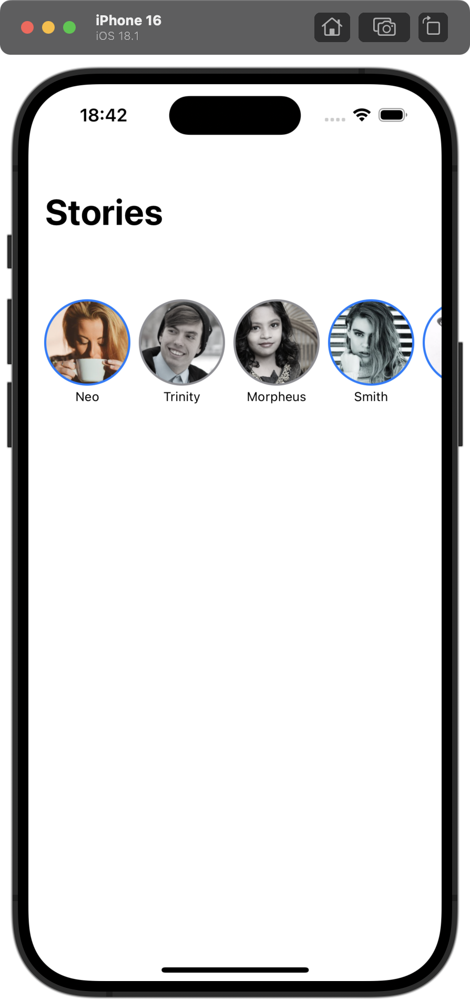

 
 
 
 

# Stories Sharing App

## Overview
This is a **SwiftUI-based Instagram Stories-like feature** that allows users to view, like, and mark stories as seen.  
It supports **pagination, persistence, and dependency injection** for scalability.

## Features

- **Story List Screen** – Horizontally scrollable stories with seen/unseen states.
- **Story View Screen** – Users can open, like/unlike, and mark stories as seen.
- **Persistent State** – Stories' seen and liked states persist across app sessions.
- **Pagination** – Supports infinite scrolling with multiple pages of stories.
- **Dependency Injection** – Uses `@EnvironmentObject` for `StoriesRepository`.
- **Optimized for SwiftUI** – Uses `@StateObject`, `@Binding`, and `@MainActor` for smooth UI updates.

## **🛠️ Tech Stack**
- **Swift 5.9**
- **SwiftUI**
- **MVVM Architecture**
- **Dependency Injection**
- **Local JSON Storage (for initial data)**

## Installation and Setup

### Prerequisites
- macOS with Xcode installed (version 16.1 or later).
- A device or simulator running iOS 18.1 or later.

### Steps to Build and Run

1. **Clone the Repository**
   ```bash
   git clone https://github.com/malayli/StoriesSharing.git
   cd StoriesSharing
   ```

2. **Open the Project in Xcode**
   Open the `StoryApp.xcodeproj` file in Xcode.

3. **Set the Build Target**
   Ensure the build target is set to an appropriate iOS device or simulator.

4. **Run the App**
   Click the **Run** button in Xcode or press `Cmd + R` to build and run the app.

## How to Use

1. **View Stories**
    - Scroll horizontally to browse available stories.
    - Tap a story to open it.

2. **Mark as Seen**
    - Once a story is opened, it will appear faded (gray overlay).
    - The app remembers seen stories across sessions.

3. **Like/Unlike a Story**
    - Inside a story, tap the heart button to like or unlike it.
    - Liked stories persist across app restarts.

4. **Pagination**
    - Scroll to the end of the list to automatically load the next page of stories.

## Technical Details

### Architecture
The app follows MVVM (Model-View-ViewModel) for better separation of concerns:

- Model: Defines the story structure.
- ViewModel: Handles business logic, persistence, and API interactions.
- View: UI components that bind to the ViewModel.

### Dependency Injection

- The app injects StoriesRepository into StoriesViewModel to decouple dependencies.
- SwiftUI’s @EnvironmentObject is used for better state management.

### Core Components
- StoryListView – Displays horizontally scrollable stories.
- StoryView – Shows a full-screen view of a story.
- StoriesViewModel and StoryViewModel – Manages pagination and state updates.
- StoriesRepository – Handles local JSON storage and persistence.

## UI Preview


